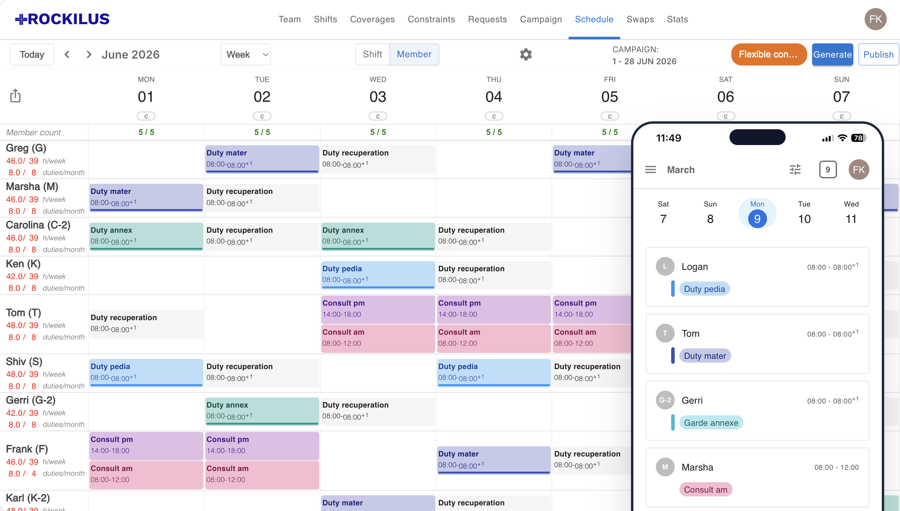
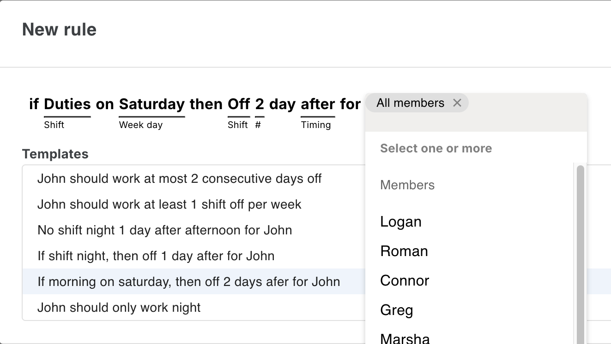
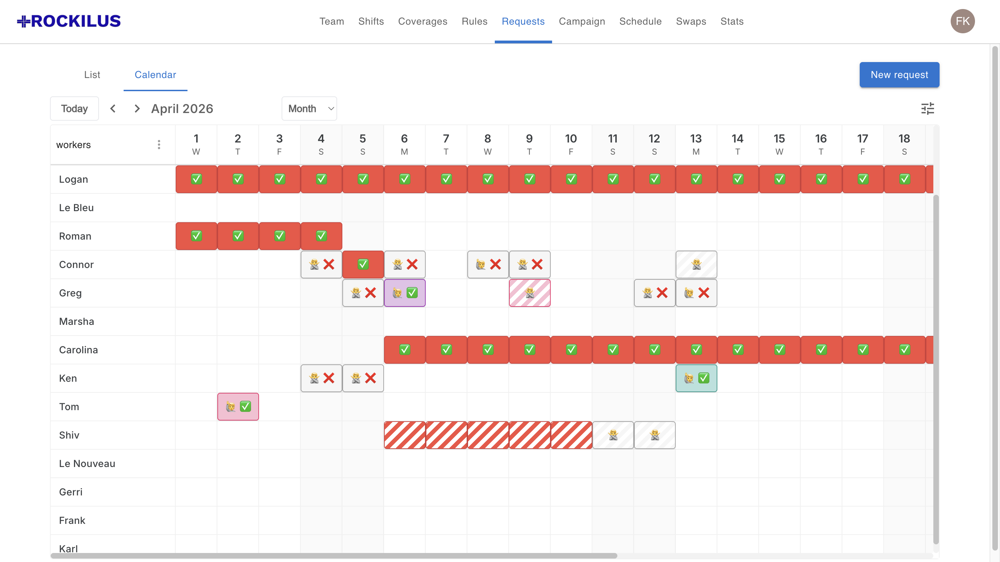
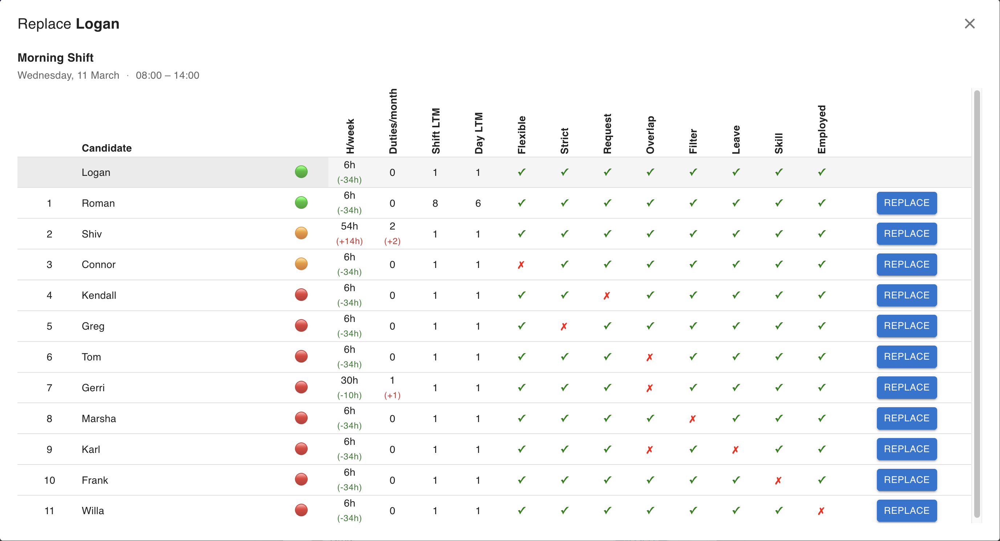
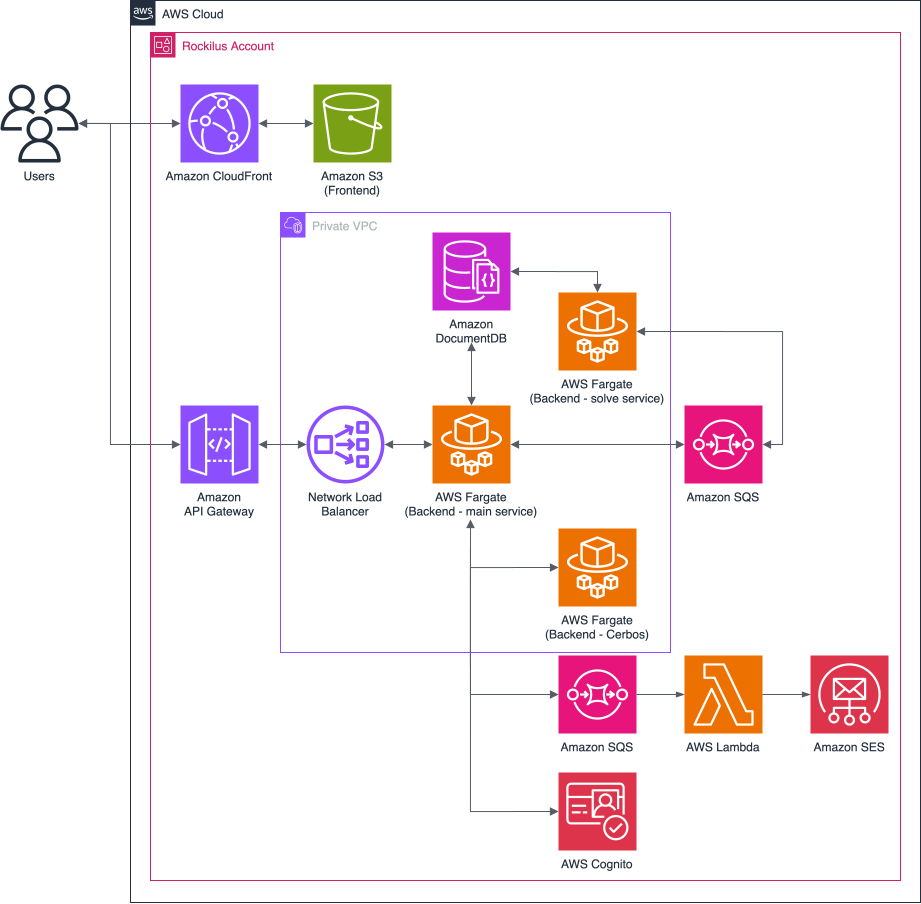

<div align="center">
  
</div>

<br>

<div align="center">
  
</div>

<br>


<p align="center">
  <a href="https://rockilus.com" target="_blank" rel="noopener noreferrer">
    
  </a>
</p>

<br>


Rockilus is a multi-tenant SaaS that lets healthcare managers define team members, shifts, and constraints, then auto-generate optimal schedules using Google OR-Tools.

<br>

## 🎯 Project Overview

### The Problem
Building and managing schedules is a chronic pain point in the healthcare sector:
* **Rigid Constraints & Compliance:** Roster generation must guarantee baseline clinical coverage targets (duties, on-call rotations) while strictly enforcing statutory labor laws (e.g., mandatory post-duty recuperation windows).
* **Search Space Complexity:** Building a schedule for a mid-sized team creates a mathematical search space with more potential states than particles in the observable universe.
* **Legacy Failure Modes:** Existing enterprise workforce management tools are cost-prohibitive and mandate lengthy, third-party implementation cycles. Many medical departments still resort to manual spreadsheet tracking. This administrative overhead is typically absorbed by healthcare personnel during clinical hours—directly reducing patient-facing care time and generating team friction over perceived shift allocation bias.


### The Solution
Rockilus is a multi-tenant workforce management application designed to automate roster generation and streamline live schedule adaptations. By converting administrative logic into a deterministic constraint-satisfaction framework, the platform delivers optimal, compliance-verified schedules through an intuitive, self-service interface.

### Key Differentiators
* **Zero-Friction Onboarding:** Eliminates enterprise integration overhead. Organizational administrators can sign up, configure their team, and generate their first schedule independently within minutes.
* **Validated Mathematical Core:** Powered by Google OR-Tools CP-SAT, an industrial-grade constraint programming engine globally validated for handling high-density combinatorial optimization problems.
* **Transparent Architecture:** Built with an open-source model to bring mature, auditable infrastructure to the healthcare sector.
* **Physician Co-Designed:** Developed from day one in close collaboration with a hospital physician.

### Core Workflow
1. **Define Core Primitives:** Map your team topology (who), shift definitions (does what), coverage targets (when), and explicit operational constraints (how).
<div align="center">
  
</div>

2. **Collect Asynchronous Preferences:** Gather staff-submitted preference matrices, specific date-off choices, and formal leave requests directly through the UI before compiling the schedule.
<div align="center">
  
</div>

3. **Execute One-Click Synthesis:** Orchestrate the backend solver engine with a single click, instantly producing conflict-free rosters alongside live telemetry covering hour distributions and constraint metrics.
<div align="center">
  
</div>

4. **Distribute & Coordinate:** Publish live rosters natively to both desktop and mobile layouts, allowing staff members to execute secure peer-to-peer shift exchanges and coverage requests on the fly.
<div align="center">
  
</div>

## ⚡️ Highlights
* **Algorithmic Shift Optimization:** Solves multi-variable healthcare scheduling matrices using a Google OR-Tools CP-SAT constraint programming model.
* **AI Copilot:** MCP and an adaptive planning/reactive router; safeguard execution boundaries via self-healing loops and a stateless, cryptographically verified tool lifecycle.
* **Asynchronous Compute Offloading:** Isolates heavy processing from user APIs via AWS SQS to guarantee gateway ingestion speeds.
* **Serverless Frontend Scale:** Deploys a Next.js static export (output: 'export') on AWS S3/CloudFront for infinite scale and zero server overhead.
* **Decoupled Security Topology:** Segregates identity verification (AWS Cognito) from access control via an isolated Cerbos PDP gRPC sidecar container.
* **Immutable Infrastructure-as-Code:** Infrastructure provisioned declaratively via Terraform.
* **Automated Quality Pipelines:** Executes continuous integration across 6 distinct GitHub Actions pipelines for multi-service linting, unit testing, and E2E validation.
* **Trilingual Native Localization:** Embeds comprehensive client-side i18n configurations supporting English, French, and Spanish with zero hardcoded UI strings.

## Table of Contents
1. [🧑‍💻 Core Engineering Challenges & Deep Dives](#challenges)
2. [Installation Steps](#installation-steps)
3. [Configuration & Setup](#configuration--setup)


## <a name="challenges"></a> 🧑‍💻 Core Engineering Challenges & Deep Dives

### 🧮 Algorithmic Constraint Optimization (Google OR-Tools CP-SAT)
Medical scheduling is an NP-hard combinatorics problem governed by fluid labor laws, staff availability, and complex multi-variable operational constraints.
* **Contract-Driven Data Transformation Pipeline:** Designed an isolation layer within `backend/solve_service/` that flattens raw MongoDB/DocumentDB multi-tenant schemas into a highly optimized, primitive input format required by the optimization engine. The scheduling horizon is parsed into discrete matrices.
* **Mathematical Search Space Definition:** The solver's primary decision matrix is modeled using Boolean decision variables bounded by the standard tuple shape `(worker_id, date_iso, shift_id)` paired with interval variables to handle overlapping time allocations at the model layer.
* **Dynamic DSL Constraint Parsing:** Engineered an abstraction layer that maps complex, string-based user constraints (e.g., *"Logan and Shiv should not exceed two consultation shifts weekly"* or *"If on duty saturday, then off following monday"*) into mathematical integer matrices bound by boolean constraints inside the CP model solver.
* **Multi-Tiered Constraint Mapping (Hard vs. Soft Fields):** User-defined team configurations and string-based dynamic constraints are parsed programmatically into mathematical models:
  * **Hard Constraints:** French labor laws (e.g., minimum 11-hour mandatory post-duty rest windows) and hard availability limits are modeled as absolute invariants using boolean logic enforcement. If a hard constraint cannot be satisfied, the solver fails immediately rather than outputting an illegal schedule.
  * **Soft Constraints:** Fluid requirements (e.g., linked shifts, specific weekend-off preferences) are mapped using indicator variables linked to penalty weights. When a soft preference is broken, an optimization slack variable triggers, capturing the exact breach context to bubble up live constraint-violation metrics and telemetry dashboards back to the frontend UI.
* **Deterministic Objective Tuning:** Enforced a strict mathematical hierarchy within the model's objective function by mapping soft constraints to non-interfering penalty coefficients. This protects against optimization anomalies where a high volume of minor preference violations (e.g. soft constraint to not do a shift) could mathematically override a critical operational priority (e.g. affect all shifts). By encoding these weights into a predictable minimization matrix, the engine delivers consistent, repeatable scheduling behavior that matches human expectations across consecutive execution horizons.
* **Empirical Model Calibration:** Built an automated benchmarking harness to run thousands of scheduling permutations under synthetic stress loads, tracking solver telemetry metrics including time-to-first-feasible-solution, conflict-graph size, and optimality-gap degradation. Collected data was used to fine-tune internal Google OR-Tools CP-SAT parameters—specifically optimizing parallel execution thresholds (`num_search_workers`), search heuristics (pseudo-cost branching strategy), and deterministic time-caps—guaranteeing rapid convergence under tight containerized CPU and memory constraints.
* **Granular Constraint Verification & Dependency Guardrails:** To guarantee long-term system stability, the CP-SAT model is not treated as a monolithic black box. Instead, a comprehensive `pytest` testing matrix completely isolates and unit-tests every individual variable declaration, hard invariant constraint, and soft penalty assignment independently. This granular verification layer ensures that future modifications to internal business logic—or upstream version updates to the Google OR-Tools package—can be executed safely, instantly catching broken mathematical expressions or behavioral drift before code hits production.

### 🤖 AI Co-Pilot Architecture (FastMCP & Directed Acyclic Graphs)
A secure, multi-lingual AI execution engine built to orchestrate complex workforce management tasks.

```text
                               [User Input Prompt]
                                        │
                                        ▼
                         [Adaptive Intent Orchestrator]
                                        │
                    ┌───────────────────┴───────────────────┐
                    ▼                                       ▼
           [Complexity: High]                       [Complexity: Low]
            Plan-and-Execute                          ReAct Bypass
                    │                                       │
                    ▼                                       ▼
          [Sequential Planner]                      [Targeted Skill]
           (Outputs JSON DAG)                       (Direct Tool Run)
                    │                                       │
                    ▼                                       ▼
         [Deterministic Engine]                    [Instant Synthesis]
         (Late Binding Iterator)                            │
                    │                                       │
                    └───────────────────┬───────────────────┘
                                        ▼
                              [Unified UI Outbound]
```


## Architectural Core
### 1. Decoupled Model Context Protocol (MCP)
To isolate raw capability implementation from the orchestrator logic, the backend exposes capabilities via **FastMCP**. Tools are grouped by bounded contexts (Roster, Shifts, Primitives) using an extensible, category-tagged decorator registry. This guarantees strict encapsulation, simplifies local unit testing, and prevents tool definition pollution inside LLM contexts.
### 2. Adaptive Hybrid Planning-Reactive (ReAct) Router
To maximize UI responsiveness and minimize LLM operational token costs, incoming prompts pass through an **Intent & Complexity Classifier**.
- **Low-Complexity Bypass (ReAct):** Trivial atomic operations (e.g., "Change Logan's name to Peter") bypass the planner entirely. A single-turn ReAct loop performs sequential identity resolution and applies direct mutations immediately.
- **High-Complexity Pipeline (Plan-and-Execute):** Requests spanning multiple domains, batch operations, or relative date-math (e.g., "End Logan's contract next Monday") are routed to the Planning Engine.
### 3. Structured JSON DAG Planner
For complex pipelines, a dedicated Planner model (with no raw execution capabilities) compiles a static, sequential **Directed Acyclic Graph (DAG)** of the tasks.
- **Late Variable Binding:** Steps can declare dependencies on prior step outputs using structured variables (e.g., assigning a calculated ISO date step to `$TARGET_DATE` and consuming it in a downstream worker creation step).
- **Self-Healing Reflection Loop:** If the local executor hits a validation or Pydantic error, the failure payload (attempted arguments + validation constraints) is caught and fed back to the Planner for a regeneration pass (up to $N$ retries).
### 4. Stateless "Pure Replay" Security Lifecycle
To prevent client-side data tampering on high-privilege write operations without introducing heavy server-side session databases (like Redis), the agent operates on a Pure Replay Strategy:
1. **The Preview Pass (`mode="preview"`):** The executor runs steps in a sandbox memory map. When a mutation tool is hit, the executor intercepts it, calculates the prospective changes, and mints a short-lived, cryptographically signed JSON Web Token (JWT) binding the active user ID and the SHA-256 hash of the execution arguments.
2. **The Stateless Halt:** The system drops all server-side memory context and sends a progress checklist and preview card to the React frontend.
3. **The Replay Pass (`mode="execute"`):** When the manager clicks Apply, the frontend passes only the original user prompt, history, and the JWT. The server completely regenerates the plan, fast-forwards through read-only steps to rebuild the variable state, verifies that the generated arguments match the cryptographic hash inside the JWT, and commits the mutation.

### 🛡️ Hierarchical Multi-Tenant AuthN/AuthZ & Group Graphs
Managing access control within fluid medical environments requires verifying a user’s functional role while dynamically isolating resources by team boundaries.
* **The Architecture:** Authentication is handled by AWS Cognito, generating cryptographically verified JWT tokens. Authorization is completely decoupled and evaluated by an asynchronous Cerbos PDP sidecar instance running over local gRPC.
* **Fine-Grained Permissions Matrix:** Resource policies in `cerbos-policies/` map permissions across three core domains: `user`, `team`, and `admin`. Managers are assigned authoritative access to write configurations and execute solver engines, while healthcare workers are strictly bound to self-owned records for viewing individual calendars, filing leave requests, or executing peer-to-peer shift swaps.
* **Graph Enforcement:** Access mutations pass through a centralized dependency injection interceptor:
    ```python
    CerbosAuthzService.check(user_id, action, resource_kind, resource_id)
    ```
    This enforces tenancy validation at the network boundary, securing background team invitations and membership routing without adding database degradation.  

### 🔒 Self-Contained Compliance Architecture (Zero-Third-Party Sovereignty)
Healthcare applications process Protected Health Information (PHI) under strict regulatory frameworks (such as GDPR and HIPAA/HDS). Delegating identity metadata or security policies to external third-party SaaS vendors introduces significant compliance risks, data cross-contamination vectors, and vendor lock-in.
* **The Strategy:** The entire stack is intentionally engineered to have zero external runtime SaaS dependencies outside of core AWS resource primitives.
* **Implementation:** By configuring an internal, isolated network footprint inside private AWS VPC subnets—pairing AWS Cognito with containerized, open-source Cerbos PDP engines and an isolated AWS DocumentDB layer—all transaction workflows, access matrices, and user identifiers stay entirely within your managed cloud boundary. This design maximizes data sovereignty, simplifies regulatory auditing, and guarantees system self-reliance.

### 📦 Contract-First Data Interoperability & Reliability
In an asynchronous environment where one microservice accepts HTTP traffic and a secondary microservice executes compute-heavy background algorithms, runtime structural drift will crash the pipeline.
* **The Strategy:** Implemented a contract-first architecture by centralizing all structural boundaries into a localized shared library located at `backend/shared/`.
* **Implementation:** Canonical data schemas (e.g., `Shift`, `Worker`, `Schedule`) are declared as immutable Pydantic contracts . Both the FastAPI gateway and the OR-Tools SQS consumer install this package as a strict dependency. This architecture guarantees that serialization and deserialization actions across SQS message lines match perfectly, eliminating type mismatch errors and payload-drift bugs before code reaches production.  


## 📐 System Architecture & Data Flows
<p align="center">
  
</p>

* **Infrastructure-as-Code (IaC):** 100% of the network infrastructure, AWS DocumentDB databases, SQS queues, IAM boundary permissions, and ECS Task Definitions are provisioned deterministically via declarative Terraform scripts.
* **Asynchronous Lifecycles:** $$\text{Client Request} \longrightarrow \text{API Gateway (FastAPI Fast ACK)} \longrightarrow \text{AWS SQS Ingestion} \longrightarrow \text{Solver Compute Service (OR-Tools)} \longrightarrow \text{DocumentDB Persistence}$$


## 🛠️ Tech Stack & Production Constraints

| Layer | Technology | Operational Constraint / Implementation Pattern |
| :--- | :--- | :--- |
| **Frontend** | Next.js 16, React 19, TS, Tailwind CSS, shadcn/ui, i18next (en/fr/es) | **Strict Static Export:** Zero Server Actions or Server Components; client-side asynchronous data fetching. |
| **API Gateway** | Python, FastAPI, Pydantic Core, uv, SQS producer | Asynchronous task ingestion; handles payload marshalling against canonical schema contracts. |
| **Solver Engine** | Python, Google OR-Tools CP-SAT, SQS consumer | Decoupled background SQS consumer optimizing multidimensional constraint matrices. |
| **Identity & Permissions** | AWS Cognito (AuthN), Cerbos PDP - gRPC (AuthZ), resource-level RBAC | Decentralized authorization mapping roles derived from localized Pydantic data schemas. |
| **Data Layer** | AWS DocumentDB (MongoDB compatible) | Document storage tracking historical assignment evaluations, team telemetry, and availability maps. |
| **Infrastructure** | Terraform, Docker Compose, just | Environment parity guarantees between local container stacks and private AWS VPC subnets. |

## 🚦 Local Development & Automated Quality Gates

The project utilizes automated task runner configurations (`justfiles`) to eliminate local dependency issues and validate type interfaces before code review gates.

### Deterministic Multi-Container Dev Spin-Up
To initiate a full-fidelity replica of the production system including message brokers and policy sidecars locally:
```bash
docker-compose -f docker-compose.yml up --build
```

### Targeted Quality Verification

Individual services enforce mandatory testing, static analysis linting, and type checking pipelines before passing environmental quality gates:

```bash
# Execute linting, typechecks, and tests for all backend services
cd backend && just all

# Execute formatting, linting, tests and security checks in frontend
cd frontend && just all

# Execute E2E test suite
cd frontend && just playwright
```

| Gate |	Backend (Python) |	Frontend (TS) |
| :--- | :--- | :---|
| Format |	ruff |	prettier |
|Lint |	ruff |	eslint |
| Typecheck |	mypy |	tsc --noEmit |
| Tests |	pytest |	vitest + playwright |
| Dep Audit |	pip-audit |	npm audit |
| SAST |	bandit + semgrep |	- |

Additional cross-cutting security scans:
```bash
cd backend && just security-all
```
| Tool |	Check |	
| :--- | :--- | 
| OWASP ZAP | Active API scan against ephemeral stack |
| Trivy | IaC + filesystem + container image CVE scan|
| Gitleaks | Full commit-history secret leak detection |
| Hadolint | Dockerfile best-practice linting |
| ShellCheck | Scripts best-practice linting |


## 🚀 Product Capabilities

While Rockilus features a complex architectural backend, it delivers a highly streamlined, enterprise-grade user experience designed to eliminate the administrative overhead of workforce management:

* **Automated Multi-Tenant Onboarding:** Self-service account provisioning and team configuration wizards that allow organizational administrators to map structural roles, departments, and shift definitions instantly.
* **Asynchronous Availability & Leave Collection:** Pre-scheduling data workflows that enable staff members to submit specific shift preferences, variable availabilities, and formal leave requests directly through the application before a schedule is generated.
* **Custom Domain Rule Definition:** An intuitive configuration interface for establishing complex operational guidelines, including rolling weekly shift caps (e.g., matching specific assignment ceilings) and conditional scheduling sequences.
* **Automated Labor Law Enforcement:** Built-in regulatory compliance guardrails that automatically inject statutory rest requirements—such as mandatory post-duty recuperation periods—directly into the scheduling engine matrix.
* **Deterministic One-Click Schedule Synthesis:** Instant orchestration of the background optimization solver, delivering complete, conflict-free shift rosters alongside a comprehensive analytics dashboard mapping exact constraint-violation metrics and workforce hour distributions.
* **Mobile-Optimized Distribution & Peer Exchanges:** A fully responsive user application providing real-time schedule sharing, automated peer-to-peer shift swapping, and fluid coverage request coordination on the go.
* **Native Cross-Border Localization:** Seamless runtime application translation supporting English, French, and Spanish, automatically adjusting language dictionaries and date-time schemas to fit regional operations.


## 🗺️ System Evolution & Engineering Roadmap

This roadmap outlines high-leverage architectural milestones designed to scale the platform from a lean, solo-developer MVP into an enterprise-grade corporate infrastructure ecosystem:

* **Event-Driven Serverless Solver Scaling (Cost & Concurrency Optimization):** Transition the `solve_service` optimization engine from a continuously provisioned, sequential-processing Amazon ECS Fargate task into a transient, event-driven AWS Lambda compute environment triggered directly by incoming SQS messages. This shift eliminates idle cloud computing spend while unlocking immediate horizontal concurrency, allowing the system to execute hundreds of localized team optimization routines simultaneously.
* **Continuous Security Hardening & Automated Vulnerability Remediation:** Establish continuous, automated security scanning guardrails within the GitHub Actions pipelines—specifically integrating automated dependency bump tools (e.g., Dependabot/Renovate) to instantly isolate and patch software supply-chain vulnerabilities. Additionally, execute a strict validation audit of AWS Identity and Access Management (IAM) role boundaries and Security Group configurations inside the Terraform modules to guarantee ironclad least-privilege enforcement across VPC runtimes.
* **Enterprise Directory Ingestion & Unified HR Aggregators:** Expand the multi-tenant onboarding layer to support federated corporate identity directory synchronization (such as LDAP, Active Directory, or SAML/OIDC) to streamline enterprise workforce importing. Build on top of the existing Excel reporting modules by architecting a unified API middleware aggregator capable of programmatically routing finalized schedules straight into legacy healthcare Human Resources and payroll systems.
* **Hierarchical Organizational Topology:** Refactor the internal data schema structures to move past flat, single-tier team boundaries (e.g., individual isolated departments) and implement a nested, multi-tiered organizational hierarchy. This structural update will enable senior administrators to coordinate complex scheduling constraints across multiple distinct services, departments, and interdependent medical procedures simultaneously.
* **LLM-Driven Semantic Constraint Ingestion (Expanding the Co-Pilot):** Augment the existing FastMCP tool registry to feed unstructured, free-form conversational requests (e.g., *"Make sure Logan doesn't work back-to-back night shifts this weekend"*) directly into the core CP-SAT matrix compiler. This will map complex user parameters directly into mathematical integer constraints, preserving the absolute mathematical safety of the underlying engine while maximizing input adaptability.
* **LLM-Driven Semantic Constraint Ingestion (Replacing Template Rigidness):** Augment the existing FastMCP tool registry to replace the rigid UI-templated constraint builder with unstructured, free-form conversational prompts and parse them into structured outputs. It maps free-form conversational requests (e.g., *"Make sure Logan doesn't work back-to-back night shifts this weekend due to a family emergency"*) directly into the deterministic JSON schema payloads expected by the core CP-SAT matrix compiler. This preserves the absolute mathematical safety of the underlying engine while maximizing input adaptability.

